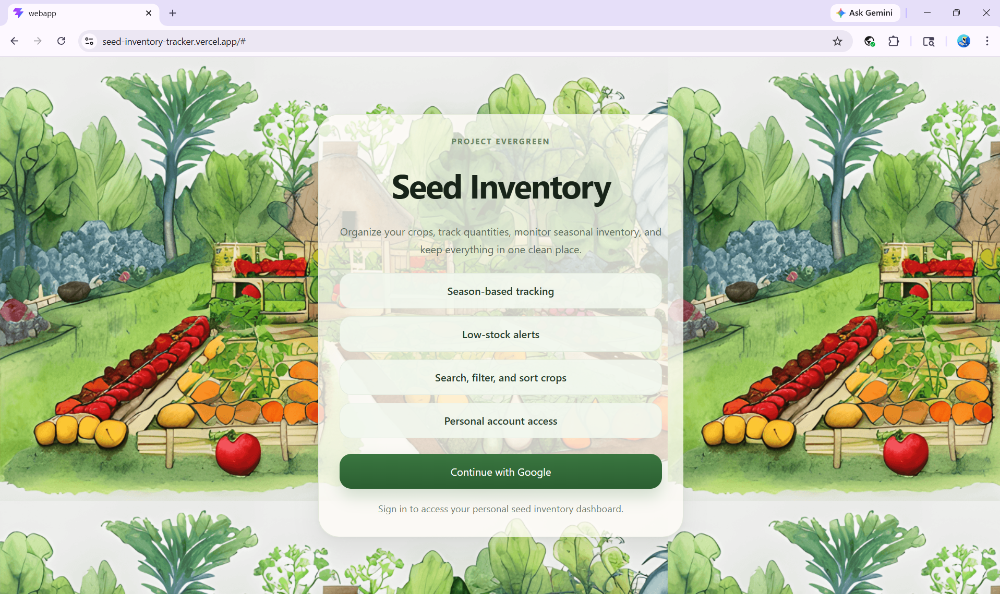
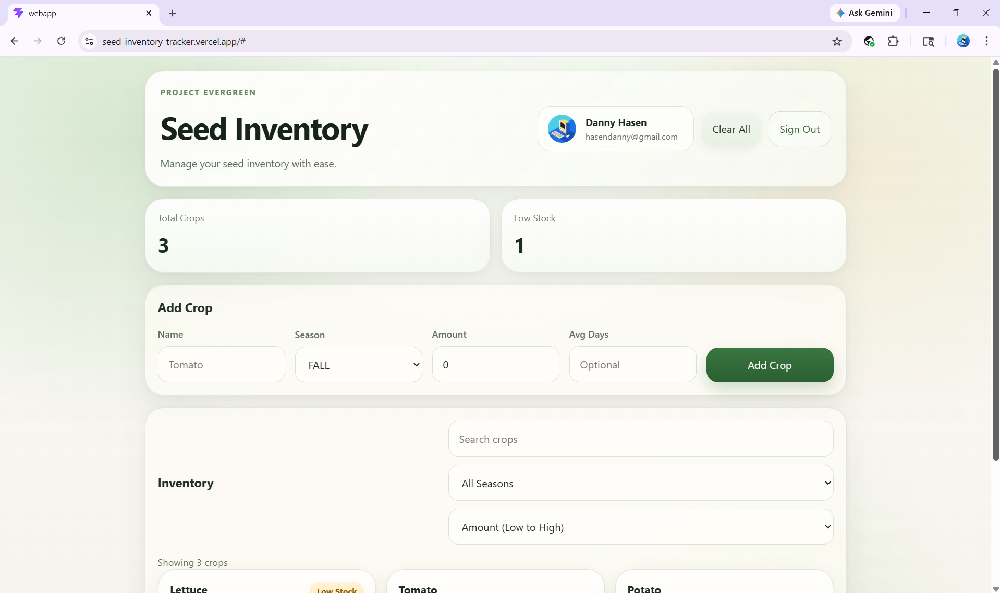
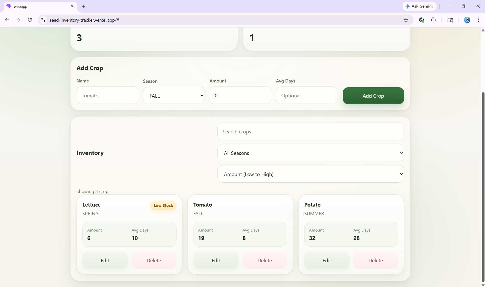

# 🌱 Seed Inventory Tracker

A full-stack seed inventory management system designed for gardeners, urban farms, and small-scale agricultural projects to track seed stock, planting data, and inventory levels.

This application provides a clean and intuitive interface for managing crops, combined with a secure backend for data storage and user authentication.

---

## 🚀 Live Demo

👉 https://seed-inventory-tracker.vercel.app/

---

## ✨ Features

### 🌾 Inventory Management

* Create, read, update, and delete crop records
* Track seed quantities and availability
* Prevent invalid operations (e.g., negative stock)

### 🔐 Authentication

* Google OAuth login via Supabase
* Per-user data isolation (each user has their own inventory)

### 📊 Data Organization

* Search, filter, and sort crops
* Clean card-based UI for quick scanning
* Mobile-friendly responsive design

### ⚡ Performance & UX

* Fast React frontend built with Vite
* Optimized rendering using React hooks
* Smooth and modern UI design

---

## 📸 Screenshots

### 🔐 Login



### 🌾 Dashboard



### 📊 Inventory View



---

## 🛠️ Tech Stack

### Frontend (`/webapp`)

* React (Vite)
* Supabase (Auth + Database)
* CSS (custom styling)

### Backend (root)

* Java
* Spring Boot
* Spring Data JPA
* PostgreSQL
* Maven

---

## 📁 Project Structure

```
testing-edits/
├── src/                # Spring Boot backend
├── pom.xml
├── webapp/             # React + Vite frontend
│   ├── src/
│   ├── public/
│   ├── package.json
│   └── vite.config.js
```

---

## ▶️ Running the App Locally

### Backend

```bash
./mvnw spring-boot:run
```

### Frontend

```bash
cd webapp
npm install
npm run dev
```

---

## 🔮 Future Improvements

* Offline support (PWA)
* Push notifications for low inventory
* Crop planting/harvest tracking
* Image uploads for crops
* Analytics dashboard

---

## 👤 Author

Built and maintained by Danny Hasen
